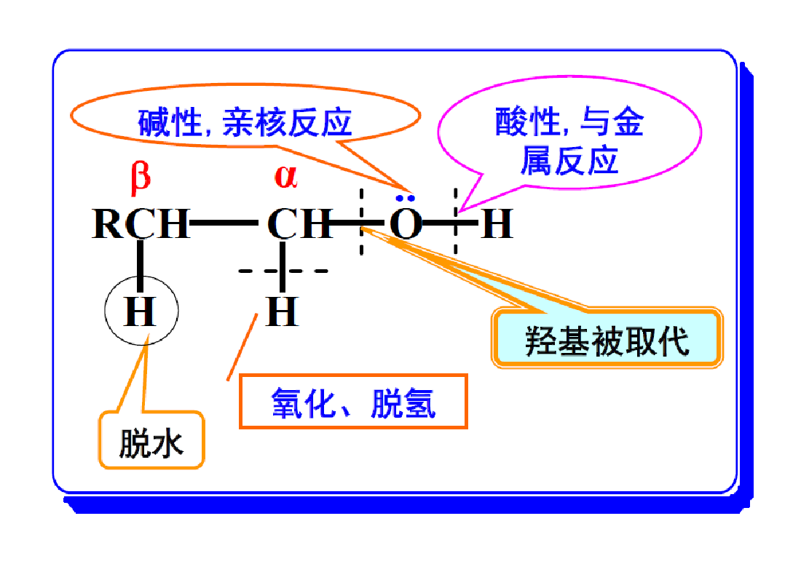

# 醇酚醚以及环氧化合物
## 醇

*图片来自教师课件*
1. 酸性以及和活泼金属的反应
2. 成酯反应
*硫酸二甲酯和硫酸二乙酯常用作甲基化和乙基化试剂*
3. 亲核取代反应
基本上就是普通的亲核取代
苄基型、烯丙型醇＞叔醇＞仲醇＞伯醇＞甲醇
HI＞HBr＞HCl＞HF
*特殊应用：卢卡斯试剂*
苄基型、烯丙型、叔和仲醇都是 $S_N1$ 机理
大多数伯醇是 $S_N2$ 机理
需求酸性条件，因为-OH不是好的离去基团
醇与二氯亚砜反应，醚类溶剂下构型不变，吡啶溶剂下构型翻转
4. 消除反应
分子间/分子内
催化剂是强酸或者路易斯酸
当用$Al_2O_3$做催化剂时没有重排现象。
E1
主要生成反式产物
5. 成醚反应
伯醇按SN2机理，仲醇按SN1或SN2机理，而叔醇一般情况下易发生消除反应生成烯烃。
6. 氧化反应
- 强氧化剂
杀杀杀杀杀杀
- 选择性氧化剂
琼斯试剂 (Jones’ Reagent): CrO3/H2SO4
沙瑞特试剂 (Sarrett Reagent):CrO3/吡啶
活性二氧化锰：MnO2
选择性氧化1°醇氧化为醛，2°醇氧化为酮，分子中的双键或叁键不受影响。
- 欧芬脑尔氧化
异丙醇铝或叔丁醇铝催化，反应历程看课件
- 催化脱氢氧化
## 邻二醇
1. 高碘酸
2. 频哪醇重排
3. 和铜的反应