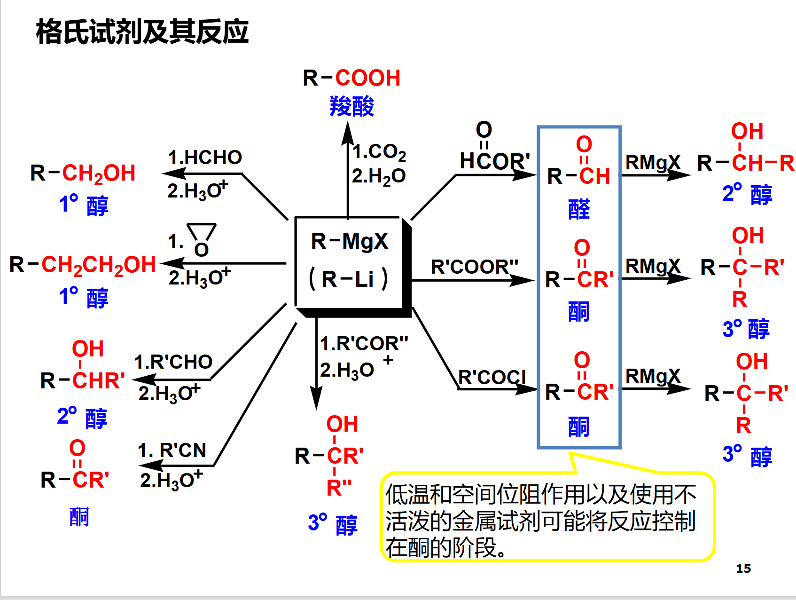

来自老师的期末复习ppt的一部分，我复习的时候进行了解释和扩展
---

### **典型化学反应的机理及相关内容**  
1. **自由基取代反应（烷烃卤代）**  
   - **三大步骤**：链引发、链增长、链终止  
   - **决定反应速率的主要因素**：烷基自由基稳定性  
   - **立体化学**：  
     - 外消旋体（非手性条件）  
     - 不等量对映异构体或非对映异构体  
2. **亲核取代反应**（卤代烃、磺酸酯、醇、羧酸及其衍生物）  
3. **亲电加成反应**（烯烃、炔烃和共轭烯烃）  
4. **亲电取代反应**（芳香烃）  
5. **亲核加成反应**（醛酮）  
6. **消去反应**（卤代烃、醇及季铵碱）  

---

### **重要的化学反应**  
#### **官能团转化的反应**  
**一、还原反应**  
1. **催化氢化**（H₂/Pt, H₂/Pd, H₂/Ni）  
初次出现于第四章，炔烃与二烯烃，顺式加成，但是直接加成到烷烃
使用林德拉催化剂（H₂/Pd/CaCO₃/喹啉）可以停留在烯烃，体现出顺式
2. **溶解金属还原**（Na/NH₃(l)）  
初次出现于第四章，炔烃与二烯烃，与林德拉催化剂相对，同样停留在烯烃，但是反式加成
*上述两者配合P88的炔化钠相关反应可以合成立体化学纯度高的含较长碳链的烯烃*
3. **金属氢化物还原**（NaBH₄, LiAlH₄）  

| 还原剂    | 适用底物       | 产物      |
| ------ | ---------- | ------- |
| NaBH₄  | 醛、酮        | 醇       |
| LiAlH₄ | 醛酮、酯、羧酸、酰胺 | 醇、醇、醇、胺 |

4. **金属—盐酸还原**（Zn-Hg/HCl, Fe/HCl）  
醛酮→亚甲基
- Zn-Hg/HCl即克莱门森还原法，初次出现于第十章，醛和酮（P271）。
需要化合物耐酸，和下文的沃尔夫-基希纳-黄鸣龙还原法对应
- Fe/HCl用于还原硝基化合物，初次出现于第十四章，有机含氮化合物（P363），金属可以选择Fe/Zn/Sn/SnCl₂，SnCl₂还可以避免还原醛基
催化氢化也可以做到这一点
5. **肼—碱还原**（NH₂NH₂/KOH）  
醛酮→亚甲基
NH₂NH₂/KOH即沃尔夫-基希纳-黄鸣龙还原法，初次出现于第十章，醛和酮（P271）
不需要化合物耐酸，和上文的克莱门森还原法对应

**二、氧化反应**  
1. 臭氧化  
把**烯烃**拆成**两个醛酮**，通过O₃通入烯烃溶液的方式生成臭氧化物，再让臭氧化物分解
初次出现于第三章，烯烃（P77）
直接水解臭氧化物会导致生成的醛立即被生成的过氧化氢氧化成羧酸，可以加入还原剂如Zn将臭氧化物分解，此时正常生成醛酮
2. KMnO₄ 氧化  
- 对于**烯烃**：碱性冷稀溶液时氧化烯烃生成邻二醇；浓热或酸性溶液时反应剧烈，R₂C=、RCH=、CH₂=分别变成酮、羧酸、二氧化碳。均初次出现于第三章，烯烃（P77）
- 对于**醇**：对于伯醇，氧化至羧酸，难以在醛停止；对于仲醇，生成酮；对于叔醇，无法氧化，但可能先脱水再氧化（用Na2Cr2O7避免）。这种方法选择性低，有选择性的见：[选择性氧化剂](#P218-醇的选择性氧化剂氧化)和[欧芬脑尔氧化](#P218-欧芬脑尔氧化)
- 对于**芳香烃**：侧链有氢则变为-COOH，否则不受影响。初次出现于第七章，芳烃（P164）
3. OsO₄ 氧化  
我书都翻麻了都没找到它在哪，等一个pr
4. H₂CrO₄ 氧化  
参见[醇的选择性氧化剂](#P218-醇的选择性氧化剂氧化)
5. HIO₄ 氧化  
对邻二醇的氧化，断裂两个羟基之间的碳碳单键，生成两分子羰基化合物
反应历程是环状高碘酸酯，因此相邻的两个羟基距离过远时无法进行
可以用四乙酸铅代替高碘酸反应，此时不经历环状过渡态，可以氧化上述不可以被高碘酸反应的邻二醇
初次出现于第九章，烯烃（P219）
6. 过酸氧化  
生成环氧化合物，不改变构型
初次出现于第三章，烯烃（P78），但环氧化合物在书P240才详细讲解

**三、Williamson 醚合成法**  
RONa + R'X → ROR' + NaX
卤代烃应选择伯仲卤代烃，叔卤代烃会分子内消除
可以用磺酸酯、硫酸酯代替卤代烃
初次出现于第九章，醇酚醚（P239）
**四、羟汞化与硼氢化反应**  
由烯烃合成醇的一对反应，前者马氏后者反马氏，都不重排
- 羟汞化-脱汞反应
先Hg(OAc)₂/H₂O，再加入NaBH₄脱汞，书本上没有详细机理
加成过程是外消旋的
- 硼氢化-氧化反应
先B2H6/THF生成烷基硼烷，再在碱性条件下用过氧化氢处理，转变成醇，书本上有详细机理
加成过程是顺式的
*如果不用过氧化氢处理，而是羧酸RCOOH，可以生成将R加成上的烷烃，被称为硼氢化-还原反应*

分别初次出现于第三章，烯烃（P74）和（P76）
**五、环氧乙烷及其反应** 
- 强大的亲核开环倾向，经SN2

- 其它环氧化合物的不对称区域选择性和立体化学
见书

初次出现于第九章，醇酚醚（P240）
**六、芳香重氮盐及其反应**  
- 取代反应
    1. 被卤素或氰基取代
        1. 使用CuCl或CuBr或CuCN在加热下反应（桑德迈尔反应）
        2. 与KI共热
        3. 1.NaNO₂/H+ 2.HBF₄ 3.分离并干燥 4.Δ（希曼反应）
    2. 被羟基取代
        在酸性溶液中加热硫酸盐重氮盐，生成氧气和芳基正离子，芳基正离子立即水合生成酚
    3. 被氢原子取代
        芳香重氮盐在次磷酸水溶液中反应，重氮基被氢取代，乙醇也可以，但有副产物醚。
    4. 重氮盐的取代反应在合成中的应用
        -NH₂是邻对位定位基，但可以通过3所说的方法除去
- 还原反应
    1. 在还原剂的作用下重氮基被还原为肼
        常用还原剂为氯化亚锡、亚硫酸钠、亚硫酸氢钠、硫代硫酸钠
- 偶联反应
    见P388，感觉没有后续反应不太会考（？）我瞎猜的

初次出现于第十四章，有机含氮化合物（P385）
**七、羧酸及其衍生物的相互转化**  

酰卤>酸酐>羧酸>酯>酰胺
试着不看上面那张图写出每个转化吧
别忘了我们的腈

初次出现于第九章，醇酚醚（P240）
---

#### **C-C键形成的反应**  
**八、格氏试剂及其反应**  
Mg/THF，使得卤代烷成为碳负性非常强的试剂
需要：
    1. 伯卤代烷或仲卤代烷，若叔卤代烷在强碱下发生消除
    2. 无有活泼氢的基团，若有则自身反应

比较用的多的是+CO₂将卤代烃转化为羰化合物和将其作为亲核试剂使用

另，将Mg换成Zn则不与酯反应，但仍然与羰基反应，即瑞佛马斯基反应（P314）
初次出现于第八章，卤代烃（P184）
**九、Diels-Alder 反应**  
共轭二烯烃和含碳碳双键或三键的化合物发生1,4-加成生成六元环状化合物
属于周环反应，但周环反应我没学好
初次出现于第四章，炔烃与二烯烃（P101）
**十、羟醛加成及缩合反应**  
两分子醛在酸或碱（通常稀碱）的催化下生成β-羟基醛的反应
本质上是一个醛变成烯醇负离子和碳负离子的杂化体，作为亲核试剂进攻另一个醛的羰基碳
一般是相同的两分子醛，或者其中一个醛没有α氢，否则反应产物过多无价值
β-羟基醛可加热脱水生成α,β-不饱和醛用于进一步反应，例如[Michael 加成](#十二michael-加成和-robinson-环合)
初次出现于第十章，醛和酮（P264）；在第十三章，碳负离子的反应（P355）有再次讨论。
**十一、Claisen 酯缩合和 Dickman 酯缩合**  
类似于羟醛缩合，两分子酯在碱（通常是乙醇钠）的作用下，将一分子酯的α-氢用另一分子的酰基取代
一般需要酯有两个α-氢，若只有一个需要用三苯甲基钠才能反应
二元羧酸酯的分子内酯缩合（一般需要反应后是五元或六元环）也成为狄克曼缩合
初次出现于第十三章，碳负离子的反应（P351，我在酯找了半天🤯）
##### **十二、Michael 加成和 Robinson 环合**  
α,β-不饱和共轭体系和亲核的碳负离子进行的1,4-共轭加成
先是活泼的亚甲基（连接两个吸电子基）在碱（常常是乙醇钠）的作用下失去一个氢，然后和α,β-不饱和共轭体系进行1,4-共轭加成（类似于将氢暂时借给碱，在共轭加成这一步从水里拿回来），形成的烯醇又互变为羰基
Michael 加成和 Robinson 环合初次出现于第十章，醛和酮（P281）在第十三章，碳负离子的反应（P357）有再次讨论。
**十三、乙酰乙酸乙酯和丙二酸二酯的应用**  
- **乙酰乙酸乙酯**：由于乙酰乙酸乙酯在有一个活泼亚甲基的基础上还可以酸式分解和酮式分解，我们可以利用一次亚甲基之后进行酮式分解/酸式分解得到取代丙酮/烷基取代乙酸，但以此生成取代乙酸会有取代丙酮副产物，故更经常采用丙二酸二酯进行丙二酸酯合成法
- **丙二酸二酯**：类似于乙酰乙酸乙酯的反应，但是进行完亚甲基反应之后水解然后加热脱羧，坏处和好处都是不生成取代丙酮

初次出现于第十三章，碳负离子的反应（P353）

---

### **有机化合物的化学鉴别法**  
1. **不饱和键（烯、炔）**：Br₂/CCl₄  
加成反应
2. **醛、单糖、α-羟基酸**：AgNO₃/NH₃-H₂O  
即银镜反应
3. **甲基酮及其还原态**：I₂/NaOH  
甲基酮或乙醛在一侧有三个α碳，故会生成三卤化物，将羰基碳原子的电正性增强，以至于碱性溶液中的OH-能够进攻羰基碳，生成羧酸和卤仿
在使用碘的情况下，会生成有特殊臭味的黄色固体碘仿，其不溶于反应液，故用于鉴别
4. **醇、酚、酸、胺的分离**  
此外，醛酮可以通过和亚硫酸氢钠加成分离
5. **不同类型卤代烃**：AgNO₃/EtOH  
- 卤素种类：
AgCl（白）、AgBr（淡黄）、AgI（黄色）沉淀
- 取代数目：
叔卤代烃（SN1）→ 快
仲卤代烃 → 较慢
伯卤代烃 → 最慢
6. **酚、烯醇**：FeCl₃-H₂O  
见书P234
苯酚、间苯二酚：粉色
甲苯酚：蓝色
邻对苯二酚：绿色

---

### **有机合成中的立体化学问题**  
- Sₙ² 反应的 **Walden 构型转换**  
    见[SN12E12.md](./SN12E12.md)
- 消去反应中的 **反式共平面消去**  
- 烯烃的 **顺式加氢**、与卡宾的 **顺式加成**  
- 烯烃与溴的 **反式加成**  
- 羰基亲核加成的 **Cram 规则**  
- 环加成和电环化的 **立体化学专一性**  
- 碳正离子重排中的 **反式迁移**  
- Beckmann 重排中的 **反式基团迁移**  

---

### **注意事项总结**  
- **反应试剂及条件**  
- **反应活性**  
- **适用范围**  
- **立体化学**  
- **多官能团化合物的反应选择性**

### **一些其它总结**
##### **P218-醇的选择性氧化剂氧化**
氧化醇至醛酮，不氧化双键和三键。
使用**沙瑞特试剂[CrO₃/(C5H5N)₂]**、**琼斯试剂[CrO₃/H2SO₄]**、**活性二氧化锰**
##### **P218-欧芬脑尔氧化**
将仲醇和丙酮反应成酮和异丙醇，只转移仲醇上的两个氢原子，不影响其他基团
使用 **[(CH₃)₂CHO]₃Al**
它的逆反应是[麦尔外因-彭多夫还原](#P272-麦尔外因-彭多夫还原)
##### **P272-麦尔外因-彭多夫还原**
使用 **[(CH₃)₂CHO]₃Al-(CH₃)₂CHOH** 选择性将醛酮氧化为醇
是欧芬脑尔氧化的逆反应

##### **P229-克莱森重排**
施工中

##### **P230-弗莱斯重排**
施工中

##### **P232-柯尔柏－施密特反应**
施工中

##### **P233-瑞穆尔－梯门反应**
施工中

##### **P155-F-C反应**
通过AlCl₄将一些物质转化为碳正离子，使其得以加成在芳环上的反应
- F-C烷基化
被转化的物质是卤代烷，容易发生重排
也可以不用AlCl₄，而是用烯或醇在酸催化下形成碳正离子
有-NO2、-SO3H、-CN和羰基等吸电子基时不可发生
使用AlCl₄时不容易加成到酚上，会形成配合物降低苯的电子密度，需要较高温度才能反应
- F-C酰基化
被转化的物质是酰卤或酸酐，停留在一取代（酰基本身会钝化苯）
有强吸电子基时不可发生

##### **P220-频哪醇重排**
施工中

##### **P240-环氧化合物**
施工中

##### **P269-曼尼希反应**
施工中

##### **P275-维蒂希反应**
施工中

##### **P336-霍夫曼降解**
施工中

---
看完了吗，来[检验一下](./期末笔记-空.md)自己的成果吧