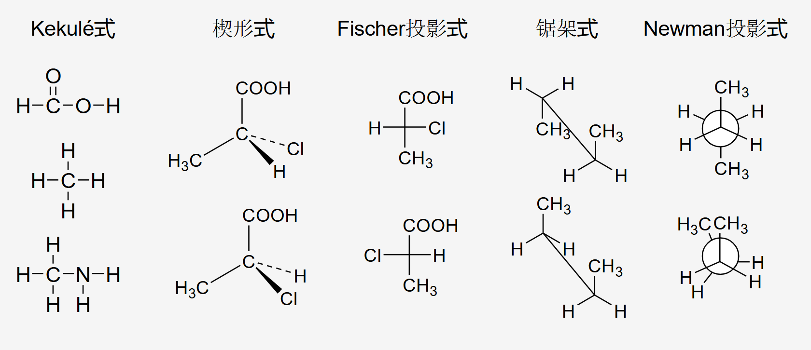
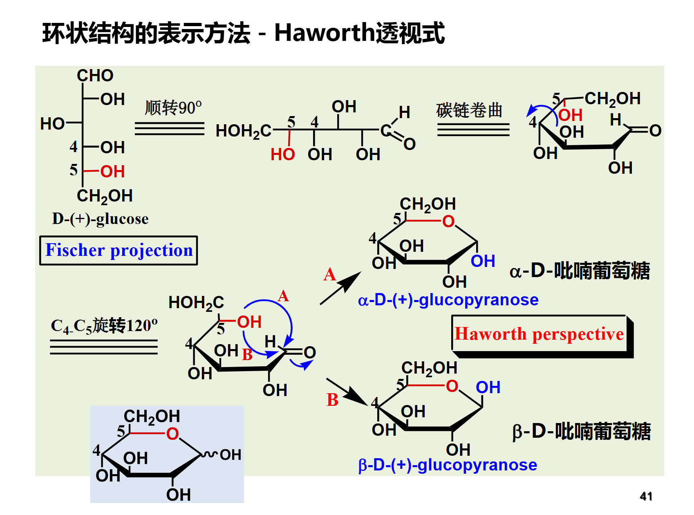
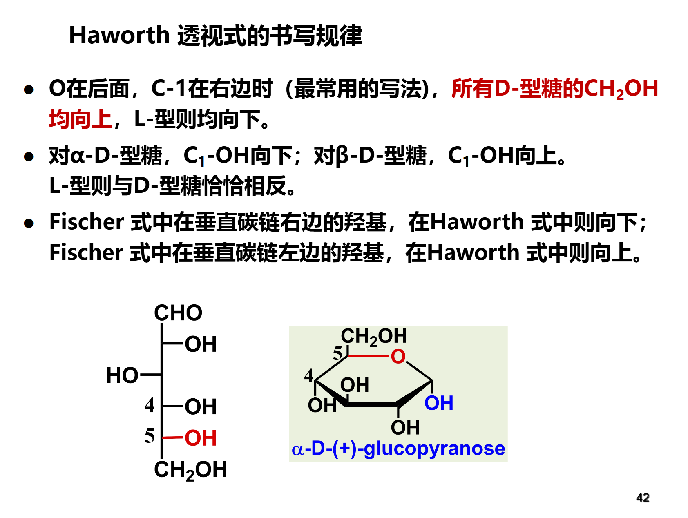

#### 用于描述手性情况
##### RS构型
原子序数大则优先，相同则比较其链接的基团
多种方法记一种就行，我记的方向盘法

##### DL构型
以甘油醇为标准
对于糖，若编号最大手性碳上的羟基（-OH）在
投影式右边，则此糖为 D 型糖

##### 赤苏构型
费歇尔投影时两个H同侧则赤，异侧则苏 

#### 用于描述构象情况
##### ZE构象
优先的两个基团同侧为Z，异侧为E

##### 顺反构象
相同基团在同侧为顺，在异侧为反

##### ea构象
平伏是e，直立是a
大基团e优势
调ea的时候不能改变顺反构型

#### 画图方式
不难画都，但是记得把名字和种类对应上

对于糖的费歇尔投影式，羰基碳在上

